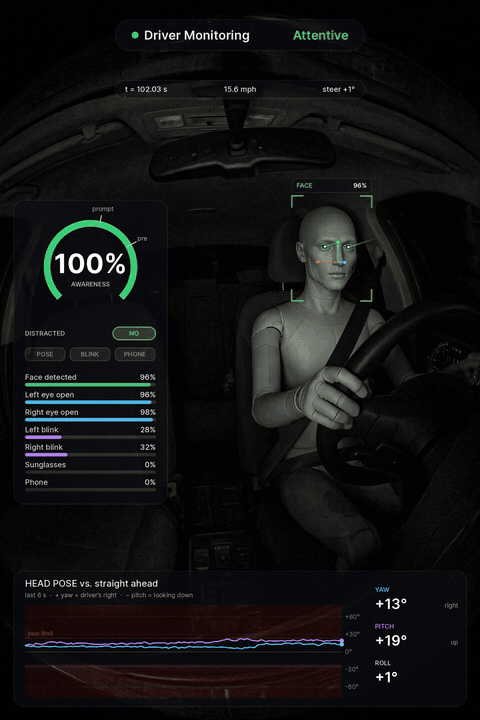

# Driver-Mover

**Turn the driver-monitoring data from your openpilot / BogPilot drives into a video** — a heads-up display and a
3-D head model drawn on a photo, or a photo whose head actually turns the way the driver's did.

<p align="center">
  <a href="docs/example_mirror_checks.mp4"></a><br>
  <sub><b>Example</b> — 15 s at an intersection: a glance left (~−26°), a big look right (~+54°), left again, then the right turn.
  No alerts; awareness stays at 100 %. Rendered with <code>--realhead</code> on the bundled mannequin photo.
  <a href="docs/example_mirror_checks.mp4">Full-quality MP4</a>.</sub>
</p>

Driver-Mover reads the **rlogs** your comma device records and shows what the driver-monitoring (DM) system
saw: head yaw/pitch/roll, face/eye/blink/phone scores, the awareness meter, the distraction zone and any
“Pay Attention” / “Driver Distracted” alerts.

* **Overlay mode** (default) – HUD + 3-D wireframe head on any photo.
* **Realistic-head mode** (`--realhead`) – cross-dissolves between “keyframe” images of the same person in
  different head poses, so the person in the photo moves like the driver did. Only the head/neck area ever
  changes; the steering wheel, hands and seatbelt stay pixel-for-pixel the original photo.
* `find` – lists the most interesting moments in a drive automatically.

Everything runs **locally on your computer, on the CPU**. No full openpilot checkout is needed (the log
schemas are bundled). Location/GPS data in the logs is never read.

> Driver-Mover is an independent hobby project. It is **not affiliated with or endorsed by comma.ai**.
> It is a visualisation toy, not a safety tool.

---

> **Coming soon in v2:** the mannequin's hands will turn the steering wheel to match the steering angle recorded in your rlogs.

## Contents

1. [Install](#1-install)
2. [Get your rlogs](#2-get-your-rlogs)
3. [Find interesting moments](#3-find-interesting-moments)
4. [Render a video](#4-render-a-video)
5. [Use your own photo](#5-use-your-own-photo)
6. [Make keyframes for realistic-head mode](#6-make-keyframes-for-realistic-head-mode)
7. [Settings file reference](#7-settings-file-reference)
8. [How the numbers are computed (assumptions)](#8-how-the-numbers-are-computed-assumptions)
9. [Troubleshooting](#9-troubleshooting)
10. [Project layout](#10-project-layout)
11. [Licenses and credits](#11-licenses-and-credits)

---

## 1. Install

All commands in this section run **in a terminal on your own computer** (not on the comma device).

### System packages

**Linux (Ubuntu / Debian):**

```bash
sudo apt update
sudo apt install git ffmpeg libgles2 libegl1 python3-venv
```

(`libgles2`/`libegl1` are graphics libraries the MediaPipe face-landmark tool needs, even on the CPU.)

**macOS** (with [Homebrew](https://brew.sh)):

```bash
brew install git ffmpeg python@3.12
```

### Driver-Mover itself

```bash
git clone https://github.com/BogPilot/Driver-Mover.git
cd Driver-Mover
python3 -m venv .venv            # macOS with Homebrew: python3.12 -m venv .venv
source .venv/bin/activate
pip install --upgrade pip
pip install -e .
drivermover --help
```

This installs numpy, OpenCV, Pillow, pycapnp, zstandard and MediaPipe into the private `.venv` folder
(≈150 MB, no GPU needed). Python 3.10–3.13 are supported (tested on Linux with 3.12 and 3.13; macOS uses
the same pip packages).

**Each time you open a new terminal**, re-activate it first:

```bash
cd Driver-Mover
source .venv/bin/activate
```

The command is `drivermover`; `dmoverlay` is an alias for the same thing.

---

## 2. Get your rlogs

A drive (“route”) is split into ~1-minute **segments**. Each segment folder holds an `rlog` file (newer
versions: `rlog.zst`; uploaded copies: `rlog.bz2` or `rlog.zst`). Driver-Mover needs **rlogs**
(full logs) — `qlog`s are too sparse. Segment folders look like

```
0000abcd--0123456789--0
0000abcd--0123456789--1
...
```

(older software uses date-style names such as `2024-05-01--12-34-56--0`; both work). Put all segments of one
route into one folder on your computer, e.g. `~/rlogs/my_drive/`.

### (a) Copy straight from the comma device over SSH (fastest, no upload needed)

One-time, **on the comma device's screen**: *Settings → Developer* → enable **SSH**, and under *SSH Keys*
enter your GitHub username (the device then trusts the SSH keys on your GitHub account). Find the device's
IP address under *Settings → Network → Advanced* (Wi-Fi) — below it is written as `<device-ip>`.
Your computer and the device must be on the same network.

Run these **on your own computer** (the device is the *source*, your computer is the *destination*):

```bash
# list the routes stored on the device (newest last)
ssh comma@<device-ip> 'ls /data/media/0/realdata/'

# copy every segment of one route into ~/rlogs/my_drive/
mkdir -p ~/rlogs/my_drive
scp -r 'comma@<device-ip>:/data/media/0/realdata/0000abcd--0123456789--*' ~/rlogs/my_drive/
```

Replace `0000abcd--0123456789` with the route name from the list. The device deletes old routes when its
storage fills up, so copy interesting drives soon. If you only want the logs (not the large camera videos),
copy just the rlog files:

```bash
for d in $(ssh comma@<device-ip> 'ls -d /data/media/0/realdata/0000abcd--0123456789--*'); do
  mkdir -p ~/rlogs/my_drive/$(basename $d)
  scp "comma@<device-ip>:$d/rlog*" ~/rlogs/my_drive/$(basename $d)/
done
```

### (b) Download from comma connect

If your device is paired with [comma connect](https://connect.comma.ai) and online (Wi-Fi):

1. Open connect.comma.ai **in a browser on your computer**, pick the drive, open **Files**.
2. Under *All logs* click **Upload … logs** and wait in *View upload queue* until every rlog is uploaded
   (the device uploads them the next time it is online).
3. Download the `rlog.bz2` / `rlog.zst` files for the segments you want into one folder. Keep the segment
   number in each file name, e.g. `0000abcd--0123456789--5--rlog.zst`, so Driver-Mover can order them.

If the upload buttons are greyed out, check at [useradmin.comma.ai](https://useradmin.comma.ai) that the
device shows *Uploads Accepted*. useradmin also lists routes and download links for uploaded files.

### (c) Forks (BogPilot, FrogPilot, sunnypilot, …)

* Logs are stored in the same place (`/data/media/0/realdata/`) and the same way on forks.
* The bundled log schema is BogPilot's (a FrogPilot-based fork). It also reads stock openpilot and
  FrogPilot logs of a similar age. If you get schema errors with another fork, point Driver-Mover at that
  fork's own `cereal/` folder: `--schema-dir /path/to/that-fork/cereal`.
* Some forks rename or move messages (e.g. newer openpilot moved alert text from `controlsState` to
  `selfdriveState`); missing optional messages just leave that part of the HUD empty.

You can pass Driver-Mover the **route folder**, single **segment folders**, or individual
`rlog` / `rlog.zst` / `rlog.bz2` files.

---

## 3. Find interesting moments

On your own computer:

```bash
drivermover find ~/rlogs/my_drive
```

Example output:

```
 1. --start 302.0   (302.0-317.0 s; segment 5, 1.9 s in)  score 17.0
    1x Driver Distracted (orange), 2x Pay Attention, awareness dropped to 29%, head turned up to 71°
 2. --start 420.0   (420.0-435.0 s; segment 6, 59.9 s in)  score 3.6
    head turned up to 35°
```

Times are seconds from the start of the first segment you gave it. Options: `--top 10`, `--duration 20`.
Takes a few seconds for a 10-minute drive.

---

## 4. Render a video

**Overlay mode** (bundled mannequin photo):

```bash
drivermover render ~/rlogs/my_drive --start 302 --duration 15
```

**Realistic-head mode** (bundled mannequin keyframes are used automatically):

```bash
drivermover render ~/rlogs/my_drive --start 102 --duration 15 --realhead
```

* Leave out `--start` to auto-pick the best window from `find`.
* Output goes to `drivermover_out/` in the folder you ran the command from, e.g.
  `drivermover_out/dm_my_drive_302s.mp4`, plus a `_contact.png` (6 stills) and `_poster.png`
  (skip them with `--no-sheet`). Realistic-head mode also writes a `_keyframes.png` sheet. Choose the
  file yourself with `--out ~/Videos/drive.mp4`.
* Typical time for 15 s: overlay ≈25 s on 8 CPU cores (≈1 min on 4); realistic head ≈40 s (≈1.5–2 min).
  `--workers 2` uses fewer cores.
* Videos are H.264 MP4, 30 fps, with container metadata stripped.

How realistic-head mode works:

1. **Align** – each keyframe is matched to the photo by background/body features (SIFT + RANSAC) so its
   head lands exactly where the photo's head is.
2. **Measure** – MediaPipe face landmarks give each keyframe's head yaw/pitch; a **mirrored** copy of each
   keyframe covers the other side.
3. **Schedule** – for every moment of the log the closest pose is chosen, with hysteresis and a minimum
   hold time so it doesn't flicker; a little rigid shift/roll follows the data in between.
4. **Composite** – 0.2 s cross-dissolves between unwarped keyframe heads, inside a protected head/neck
   mask. Looking forward = the original photo.

---

## 5. Use your own photo

1. **Anchor the face** (on your own computer):

   ```bash
   drivermover calibrate --image ~/Pictures/driver.jpg --auto
   ```

   This finds the face, writes `driver.json` next to the photo, and saves
   `drivermover_out/driver_calibration.png`. Open the PNG: the yellow cross should sit between the eyes,
   the circles on the eyes, the wireframe on the head, and the pink outline should cover head + neck but
   **not** the wheel or hands.

2. If it's off, set the values by hand (pixel coordinates, 0,0 = top-left) and check again:

   ```bash
   drivermover calibrate --image ~/Pictures/driver.jpg --eye-mid 812 590 --interocular 58 --yaw 12
   ```

   * `--eye-mid X Y` – point between the eyes
   * `--interocular PX` – distance between eye centres (scales everything)
   * `--yaw DEG` – how far the photo's head is already turned (+ = toward image-right); wireframe only

3. Render: `drivermover render ~/rlogs/my_drive --image ~/Pictures/driver.jpg` (the `.json` beside the photo
   is loaded automatically, or pass `--config file.json`).

The HUD layout is designed for portrait photos (like the 1152×1728 example); other sizes work, centred.

---

## 6. Make keyframes for realistic-head mode

Use any image generator or face-rotation / photo-editing tool. Ask it to keep **the exact same photo —
same person, camera, framing, lighting, background, hands and wheel — and change only the head pose**.
Save the results (`.jpg` / `.png`, any names) in one folder.

| Pose | Purpose |
|---|---|
| your photo itself | “looking forward” – used automatically, don't add it |
| head turned ≈20–25° to one side | small glances, mirror checks |
| head turned ≈45–60° to the same side | big looks (side mirror, shoulder check) |
| head tilted down ≈15–25° | looking at the lap / phone / console |
| *optional:* the other side of each | otherwise mirrored copies are generated |
| *optional:* nearly frontal (≈0°) | helps when your photo's head is turned a lot |

Tips: same resolution/framing as the photo works best (keyframes are re-aligned, but enough of the
background and body must be visible to match); avoid changing hair or lighting; a real other-side keyframe
looks better than a mirrored one when the scene is lit from one side.

```bash
drivermover render ~/rlogs/my_drive --image ~/Pictures/driver.jpg --realhead --keyframes ~/Pictures/driver_keyframes
```

Check the `_keyframes.png` sheet: each keyframe is shown after alignment with its measured yaw/pitch and
whether it was used (one within 5° yaw / 4° pitch of another is skipped as a duplicate).

The bundled example lives in `src/drivermover/examples/mannequin/` (`photo.jpg`, `photo.json`,
`keyframes/head_down.jpg`, `turn_small.jpg`, `turn_large.jpg`, `near_front.jpg`).

---

## 7. Settings file reference

`<photo>.json` (written by `calibrate`; example: `src/drivermover/examples/mannequin/photo.json`). Missing
keys fall back to the defaults below.

| Key | Default | Meaning |
|---|---|---|
| `face.eye_mid` | – | `[x, y]` point between the eyes (pixels) |
| `face.interocular_px` | – | eye-centre distance; all offsets scale by `interocular_px / 56` |
| `face.apparent_yaw_deg` / `apparent_pitch_deg` | 12 / 0 | the photo's own head pose, for the wireframe |
| `data_mapping.positive_yaw_is_image_right` | true | flips the wireframe's turn direction (e.g. for a mirrored photo) |
| `data_mapping.positive_pitch_is_up` | true | flips the wireframe's nod direction |
| `hud.speed_units` | `mph` | or `kmh` |
| `hud.vignette` | true | darken the photo edges |
| `realhead.dissolve_s` | 0.2 | cross-dissolve length (s) |
| `realhead.min_hold_s` | 0.35 | minimum time on one keyframe |
| `realhead.hysteresis_deg` | 8 | how much better a new pose must fit before switching |
| `realhead.near_photo_yaw_deg` | 8 | keyframes this close to the photo's own pose are skipped (the photo is used instead) |
| `realhead.dedupe_yaw_deg` / `dedupe_pitch_deg` | 5 / 4 | keyframes closer than this count as duplicates |
| `realhead.down_keyframe_pitch_deg` | 5 | keyframes pitched down more than this are “head-down” |
| `realhead.head_down_start_deg` / `head_down_full_deg` | 8 / 22 | data pitch where head-down keyframes fade in / are full |
| `realhead.micro_shift_px` / `micro_roll_deg` | 4 / 2 | max rigid shift / roll between keyframes |
| `realhead.allow_polygon_rel` | (mannequin) | protected head/neck zone as offsets from `eye_mid` in reference pixels — edit if the pink outline in the calibration preview touches the wheel or hands |

The anchoring offsets (face box, head crop, protected zone) were derived on the mannequin photo (eye_mid
808, 592; interocular 56 px) and scale with `interocular_px`.

---

## 8. How the numbers are computed (assumptions)

* **Messages used**: `driverStateV2` (net face orientation/position, face/eye/blink/sunglasses/phone
  probabilities), `driverMonitoringState` (events, awareness, distracted flags), `controlsState` (alert text),
  `carState` (speed, steering angle), `liveCalibration` (device mount angles). Nothing else is read.
* **Head angles** follow openpilot's `face_orientation_from_net`: the net's angles are corrected for where
  the face sits in the 1928×1208 driver-camera image (focal length 598 px) and for the device mount
  (`liveCalibration.rpyCalib`, per sample). + yaw = driver's right.
* **Straight ahead**: openpilot learns the driver's usual pose after ~60 s; until then it uses fixed
  “natural” offsets. The HUD shows whichever openpilot was using. The moving head is drawn relative to the
  driver's own forward pose (median of the 15 s before and after the window, excluding distracted moments),
  so the original photo = looking forward.
* **Left-hand drive** unless the log says right-hand drive (`isRHD`). The camera is assumed to face the
  driver from the windshield centre, so the driver turning to their right appears toward image-left.
* **Thresholds** shown (pose yaw ≈23–29°, pitch ≈26°, awareness 8/11 pre-alert, 6/11 prompt) are openpilot's
  driver-monitoring defaults.
* Roll is drawn clockwise-positive (not verifiable from the data). Gaze isn't logged separately; gaze lines
  follow head pose.
* The “Distracted” pill reflects openpilot's own pose/blink/phone flags; at low speed openpilot may flag a
  pose as distracted without lowering awareness or alerting (as in the example video).

---

## 9. Troubleshooting

| Problem | Fix |
|---|---|
| `drivermover: command not found` | `source .venv/bin/activate` in the project folder |
| `ffmpeg not found` | Linux `sudo apt install ffmpeg`, macOS `brew install ffmpeg` |
| `mediapipe could not start … libGLESv2` (Linux) | `sudo apt install libgles2 libegl1` |
| `pip install` fails building pycapnp / mediapipe | use Python 3.10–3.13 (`python3 --version`), `pip install --upgrade pip` |
| `no rlog / rlog.zst / rlog.bz2 files found` | point at the folder *containing* the `…--0`, `…--1` folders, or at the files; keep `--N` in file names |
| schema / “Not a valid capnp” errors | logs from a different fork: `--schema-dir /path/to/fork/cereal` |
| `no driverStateV2 / driverMonitoringState messages` | you gave it qlogs, or DM wasn't running — use rlogs |
| many `W0000 …` / `INFO: Created TensorFlow Lite …` lines | harmless MediaPipe messages |
| realistic head: “skipping …: too few matching features” | regenerate that keyframe closer to the original framing |
| realistic head looks pasted or turns the wrong way | check the `_keyframes.png` sheet; remove bad keyframes |
| wireframe not on the face | re-run `drivermover calibrate` with `--eye-mid` / `--interocular` |

---

## 10. Project layout

```
Driver-Mover/
├── README.md  LICENSE  THIRD_PARTY_NOTICES.md  pyproject.toml
├── docs/example_mirror_checks.{mp4,gif}   the example above
└── src/drivermover/
    ├── cli.py         `drivermover` command (find / render / calibrate)
    ├── logreader.py   finds segments, decompresses .zst/.bz2, reads with the bundled schemas
    ├── data.py        log messages → timelines (head angles, awareness, alerts, speed)
    ├── find.py        scores windows for `find` / auto-pick
    ├── config.py      photo settings (JSON) and face-anchor geometry
    ├── overlay.py     HUD + wireframe drawing, ffmpeg encoding
    ├── landmarks.py   MediaPipe face landmarks / head-angle measurement
    ├── realhead.py    keyframe alignment, mirroring, pose schedule, cross-dissolve, protected mask
    ├── schema/        cereal log schemas (MIT, comma.ai — via BogPilot)
    ├── fonts/         Inter (SIL OFL 1.1)
    ├── models/        MediaPipe face landmarker (Apache-2.0)
    └── examples/mannequin/  example photo, settings and keyframes
```

---

## 11. Licenses and credits

* Driver-Mover code: **MIT** (see `LICENSE`).
* `src/drivermover/schema/`: cereal log schemas from comma.ai openpilot (via the BogPilot fork),
  **MIT**, © comma.ai — `schema/LICENSE`; `include/c++.capnp` from Cap'n Proto, MIT.
* `src/drivermover/fonts/`: **Inter** by Rasmus Andersson, SIL Open Font License 1.1 — `fonts/OFL.txt`.
* `src/drivermover/models/face_landmarker.task`: **MediaPipe** Face Landmarker by Google, Apache-2.0.
* Example mannequin photo and keyframes: provided for this project.

Details in `THIRD_PARTY_NOTICES.md`. openpilot and comma are trademarks of comma.ai; this project is not
affiliated with comma.ai.
